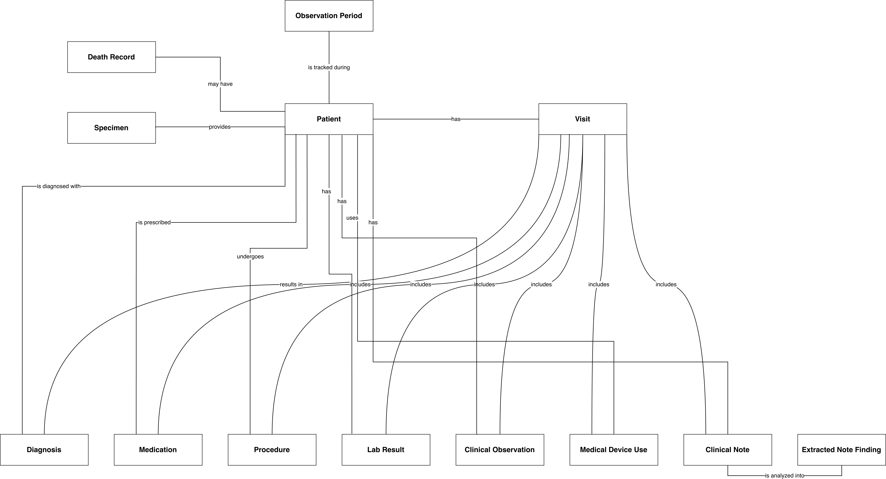
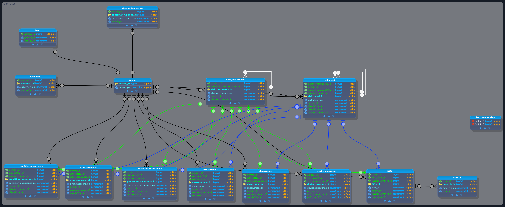

# OMOP CDM Data Modeling — Conceptual, Logical & Physical

A complete walkthrough of data modeling at three levels of abstraction —
**conceptual → logical → physical** — applied to the [OMOP Common Data
Model](https://ohdsi.github.io/CommonDataModel/) (v5.4), the community driven
standard for representing observational healthcare data.

Most data modeling portfolios show one diagram. This repo deliberately
shows the same domain three times, at three levels of detail, because
the *transitions between levels* — what gets simplified, what gets kept,
and why — are where the actual design judgment lives.

---

## View the diagrams

The three diagrams are published as an interactive site via GitHub Pages —
each level on its own page with a pan-and-zoom viewer, since the diagrams
are large enough that a static image is hard to read:

**→ https://bernt73.github.io/omop-data-model/**

---

## Why OMOP CDM?

The [OMOP Common Data Model](https://ohdsi.github.io/CommonDataModel/) is
maintained by [OHDSI](https://www.ohdsi.org/) (Observational Health Data
Sciences and Informatics), an international open-science collaboration.
It's used by hundreds of hospitals, health systems, and research networks
worldwide to represent patient-level healthcare data — diagnoses,
medications, procedures, lab results, visits — in a single, harmonized
structure, so that analytical code written once can run unmodified
against data from any institution that adopts the standard.

It's a real-world model with genuine complexity: ~40 tables, self-referencing
hierarchies, a "closed information model" vocabulary system, and
deliberate, well-documented design tradeoffs — which makes it a strong
subject for demonstrating data modeling skill beyond toy schemas.

---

## The Three Models

### 1. Conceptual Model



Entities only, in plain business language (**Patient**, **Visit**,
**Diagnosis** — not `person`, `visit_occurrence`, `condition_occurrence`),
connected by verb-phrase relationships ("Patient *has* Visit", "Visit
*results in* Diagnosis"). No keys, no data types, no cardinality
notation — built to be reviewed and validated with non-technical
stakeholders *before* any schema decisions are made.

**Scope: Clinical Data entities only.** Vocabulary, health system, and
health economics concepts are deliberately left out at this level — a
conceptual model is meant to validate the core "what happens to a
patient" story with stakeholders, and supporting/reference entities like
`Provider` or `Concept` would dilute that story rather than sharpen it.

### 2. Logical Model



Entities, primary keys, and foreign keys — the actual relationship
structure — with every non-key attribute stripped out. This is the
clinical data backbone only: vocabulary/lookup tables, health-system
tables, and health-economics tables are intentionally excluded here, so
the diagram isolates *how the clinical event tables relate to each
other* without 150+ vocabulary-lookup lines crowding the picture.

**Scope: Clinical Data only**, same as the conceptual model above. This
was a deliberate simplification, not an oversight: dropping every
`*_concept_id` relationship (which all point to the vocabulary system)
takes the model from 140 relationships down to 31, leaving only the
person → visit → clinical-event structure visible. The full
vocabulary/health-system/health-economics relationships are deferred to
the physical model below, where they belong alongside the data types and
constraints that make them meaningful.

### 3. Physical Model


The full implementation-ready schema: all columns, data types, nullability,
primary and foreign keys, organized into PostgreSQL schemas by OMOP's
official table categories (Clinical, Health System, Health Economics,
Vocabularies), with each schema rendered as its own toggleable layer so
the diagram can be viewed as a whole or filtered down to one subsystem
at a time.

**Scope: all four schemas, all 26 tables.** Unlike the conceptual and
logical models above, the physical model is the complete build — this is
the one place the vocabulary system, health system, and health economics
tables actually appear, fully wired with their real foreign keys, data
types, and constraints.

---

## Design Decisions

A few of the more interesting modeling judgment calls made along the way:

**The "closed information model" pattern in the vocabulary tables.**
`vocabulary`, `domain`, `concept_class`, and `relationship` each have a
foreign key *into* `concept` (`vocabulary_concept_id`,
`domain_concept_id`, etc.), while `concept` also has a foreign key *out
to* each of them (`concept.vocabulary_id`, `concept.domain_id`, etc.).
This isn't a mistake or a redundant pair — every one of these metadata
tables has exactly one representative row in `concept` describing
itself, so that *everything* in the CDM, including the vocabulary
system's own structural metadata, is uniformly expressible as a concept.
Recognizing this pattern mattered for getting the relationship
*direction* right in each case: the "real" structural FK and the
self-describing FK point opposite ways, and conflating them produces an
incorrect cardinality.

**`concept_relationship` as a self-join, not a junction table.**
`concept_id_1` and `concept_id_2` both foreign-key back to `concept`,
making this table a many-to-many self-relationship on `concept`,
decomposed into two separate one-to-many lines rather than one
relationship. Neither column is unique on its own — the real primary key
is the composite `(concept_id_1, concept_id_2, relationship_id)` — which
is the detail that actually confirms the cardinality.

**Why the logical model drops vocabulary lookups but keeps clinical
structure.** Simplifying from physical to logical isn't "delete
attributes at random" — it follows one principle: keep every column
that participates in a clinical-to-clinical relationship (`person_id`,
`visit_occurrence_id`, `visit_detail_id`), drop every column whose only
role is a `*_concept_id` lookup into the vocabulary system. That single
rule is what took the model from 140 relationships down to 31 without
losing any of the structure that actually defines how clinical events
relate to each other.

**`fact_relationship` and `death` have no primary key — on purpose.**
Both are valid, spec-compliant OMOP tables without a single-column PK:
`death` is keyed practically by `person_id` (a person has at most one
death record by convention, not by constraint), and `fact_relationship`
is a pure polymorphic linking table with a composite identity. Modeling
these correctly means *not* inventing a surrogate key that the real
schema doesn't have.

---

## Roadmap — Tables Not Yet Modeled

This project covers **26 of the 39 tables** in OMOP CDM v5.4 (67%), with
the **Clinical Data, Health System, and Health Economics categories
fully complete**. The remaining gaps are listed below by category, with
what each table is for — these were excluded deliberately to keep this
pass scoped, not because they were overlooked.

### Vocabularies (6 of 10 modeled)

Built: `concept`, `vocabulary`, `domain`, `concept_class`,
`concept_relationship`, `relationship`.

Not yet modeled:
- **`concept_ancestor`** — precomputed concept hierarchy closure (e.g.
  every descendant of "Diabetes Mellitus" in one query, without
  recursively walking `concept_relationship` at query time).
  Structurally identical to `concept_relationship` — two foreign keys
  into `concept` (`ancestor_concept_id`, `descendant_concept_id`) rather
  than one.
- **`concept_synonym`** — alternate names for a concept beyond its
  single primary name in `concept`. A simple one-to-many child of
  `concept`.
- **`drug_strength`** — ingredient amount/concentration and units for a
  drug product; links `drug_concept_id` and `ingredient_concept_id`,
  both back to `concept`.
- **`source_to_concept_map`** — local/legacy source-code-to-standard-concept
  mapping table, used during ETL. As of current OHDSI vocabulary
  releases, this table is no longer populated with content by OHDSI
  itself — it's an implementation-site table, not standard vocabulary
  content.

### Derived Elements (0 of 5 modeled)

- **`episode`, `episode_event`** — group related clinical events (e.g. a
  chemotherapy regimen, a disease episode) into a single higher-level
  analytic unit spanning multiple underlying `drug_exposure` /
  `procedure_occurrence` / `condition_occurrence` rows. Added in v5.4.
- **`drug_era`, `dose_era`, `condition_era`** — derived tables that
  collapse overlapping or closely-spaced exposure records into
  continuous periods, used heavily in cohort and exposure analyses.

### Metadata (0 of 2 modeled)

- **`cdm_source`** — provenance: describes the source database and the
  ETL process used to populate this CDM instance.
- **`metadata`** — general metadata about the transformed dataset itself.

**Why these were left out:** Derived Elements and Metadata tables are
either computed from the Clinical tables (eras, episodes) or describe
the ETL/dataset itself rather than patient data — modeling them well
depends on the Clinical layer being finished first, which made them a
natural second pass. The four Vocabularies gaps all follow design
patterns already established by the six vocabulary tables built here
(see *Design Decisions* above).

---

## Scope

| Model | Tables covered |
|---|---|
| Conceptual | Clinical Data only (plain-language entities) |
| Logical | Clinical Data only (PK/FK structure) |
| Physical | All 26 tables — Clinical, Health System, Health Economics, Vocabularies |

The conceptual and logical models are intentionally scoped to Clinical
Data, since that's the layer most useful for validating the core
patient/visit/event story with stakeholders and reasoning about
structure without vocabulary noise. The physical model is the full
build across all four implemented schemas. See *Roadmap* above for what's
out of scope entirely (Derived Elements, Metadata, and four remaining
Vocabularies tables).

## Tests

The site has an automated test suite (Node's built-in test runner): unit tests
for the viewer's pan-zoom geometry and contract tests over the HTML (every
internal link resolves, each page shows the right diagram, navigation wiring is
correct, images have alt text, the site is self-contained).

```bash
cd tests
npm install
npm test
```

## Tools Used

- [pgModeler](https://pgmodeler.io/) — logical and physical data modeling
- [draw.io](https://app.diagrams.net/) — conceptual ER diagramming
- [OHDSI CommonDataModel](https://github.com/OHDSI/CommonDataModel) — OMOP
  CDM v5.4 specification (reference, not redistributed here)

## License

[MIT](LICENSE) — diagrams and documentation in this repository are original
work; the OMOP CDM specification itself is maintained by OHDSI and is not
redistributed here.
